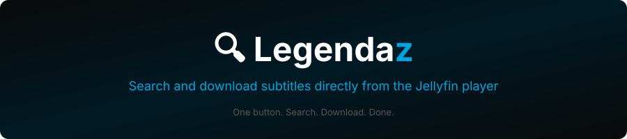

<div align="center">



<br/><br/>

[](https://jellyfin.org)
[](../LICENSE)
[](#supported-languages)
[](https://github.com/n00bcodr/Jellyfin-JavaScript-Injector)
[](https://github.com/enoch85/bazarr-jellyfin)

<br/>

**[🌐 Site](https://fabianoortega-ops.github.io/jellyfin-legendaz) · [📦 Instalar](#installation) · [🌍 Idiomas](#supported-languages) · [🐛 Problemas](https://github.com/fabianoortega-ops/jellyfin-legendaz/issues)**

<br/>

---

### 🌍 Traduções
[🇬🇧 English](../README.md) · [🇩🇪 Deutsch](README.de.md) · [🇫🇷 Français](README.fr.md) · [🇪🇸 Español](README.es.md) · [🇮🇹 Italiano](README.it.md) · [🇷🇺 Русский](README.ru.md) · [🇨🇳 中文](README.zh.md) · [🇯🇵 日本語](README.ja.md) · [🇰🇷 한국어](README.ko.md) · [🇵🇱 Polski](README.pl.md)
*Quer adicionar seu idioma? [Abra um PR!](https://github.com/fabianoortega-ops/jellyfin-legendaz/pulls)*

---

</div>

## 🎯 O que faz

O Legendaz adiciona um **botão 🔍** no OSD do player Jellyfin. Um clique abre um painel de busca — pesquise por idioma, escolha um resultado, e a legenda é baixada, a biblioteca atualizada e a faixa selecionada automaticamente.

```
  ♥  🔁  CC  🔍  🎵  ─────────  ⚙  ⛶
              ↑
         Legendaz
```

---

## ✨ Funcionalidades

| Funcionalidade | Descrição |
|---|---|
| 🔍 **Busca no Player** | Botão no OSD — sem sair do player |
| ⬇️ **Download em um clique** | Escolha um resultado e a legenda é baixada automaticamente |
| 🎯 **Seleção automática** | A legenda baixada é ativada sem nenhuma ação manual |
| 🌍 **25 Idiomas** | Detecta automaticamente o idioma do browser ou do perfil Jellyfin |
| 🔗 **Integração com Bazarr** | Busca em todos os provedores configurados no Bazarr |

---

## 📦 Instalação

### Passo 1 — Instalar JavaScript Injector (obrigatório)

Vá em **Dashboard → Plugins → Repositories → +** e adicione:

```
https://raw.githubusercontent.com/n00bcodr/jellyfin-plugins/main/10.11/manifest.json
```

> Para Jellyfin 10.10.x use: `https://raw.githubusercontent.com/n00bcodr/jellyfin-plugins/main/10.10/manifest.json`

Vá em **Catalog**, encontre **JavaScript Injector** e clique **Install**. Reinicie o Jellyfin.

> **Docker / TrueNAS:** se aparecer erro de permissão no index.html, instale também o [File Transformation](https://github.com/IAmParadox27/jellyfin-plugin-file-transformation) (v2.2.1.0+).

---

### Passo 2 — Instalar plugin do Bazarr (obrigatório)

Instale o [plugin Bazarr para Jellyfin](https://github.com/enoch85/bazarr-jellyfin) e configure com a URL e chave de API do seu Bazarr.

---

### Passo 3 — Instalar Legendaz

Vá em **Dashboard → Plugins → Repositories → +** e adicione:

```
https://fabianoortega-ops.github.io/jellyfin-legendaz/manifest.json
```

Vá em **Catalog → Subtitles**, encontre **Legendaz** e clique **Install**.

---

### Passo 4 — Reiniciar Jellyfin

Reinicie uma vez para carregar todos os plugins. O botão 🔍 aparecerá no OSD do player, ao lado do botão de legendas.

---

## 🌍 Idiomas Suportados

| Language | Code | | Language | Code |
|---|---|---|---|---|
| English | `en` | | Svenska | `sv` |
| Português | `pt` | | Norsk | `nb` |
| Deutsch | `de` | | Dansk | `da` |
| Français | `fr` | | Suomi | `fi` |
| Español | `es` | | Čeština | `cs` |
| Italiano | `it` | | Slovenčina | `sk` |
| Nederlands | `nl` | | Magyar | `hu` |
| Русский | `ru` | | Română | `ro` |
| 中文 | `zh` | | Türkçe | `tr` |
| 日本語 | `ja` | | العربية | `ar` |
| 한국어 | `ko` | | Українська | `uk` |
| Polski | `pl` | | Ελληνικά | `el` |
| | | | Català | `ca` |

---

## 💬 Comunidade

| Platform | Link |
|---|---|
| 💬 Discord (Official) | [discord.gg/zHBxVSXdBV](https://discord.gg/zHBxVSXdBV) |
| 💬 Discord (Community) | [discord.gg/N3M99fNxbK](https://discord.gg/N3M99fNxbK) |
| 🌐 Forum | [forum.jellyfin.org](https://forum.jellyfin.org) |
| 🟠 Reddit | [r/jellyfin](https://www.reddit.com/r/jellyfin) |

---

## 🔗 Relacionados

- [JavaScript Injector](https://github.com/n00bcodr/Jellyfin-JavaScript-Injector) — Dependência obrigatória.
- [File Transformation](https://github.com/IAmParadox27/jellyfin-plugin-file-transformation) — Resolve problemas de permissão no Docker/TrueNAS.
- [Bazarr Jellyfin plugin](https://github.com/enoch85/bazarr-jellyfin) — Dependência obrigatória. Conecta o Jellyfin ao Bazarr.
- [AutoPlay Toggle](https://github.com/fabianoortega-ops/jellyfin-autoplay-toggle) — Controle o autoplay do próximo episódio pelo player.
- [awesome-jellyfin](https://github.com/awesome-jellyfin/awesome-jellyfin) — Lista curada de plugins e ferramentas Jellyfin.

---

## 🤝 Contribuindo

- 🌍 **Traduzir** — adicione um `README.xx.md` para seu idioma
- 🐛 **Reportar bugs** — [abra um issue](https://github.com/fabianoortega-ops/jellyfin-legendaz/issues)
- 💡 **Sugerir funcionalidades** — ideias são bem-vindas
- ⭐ **Dar uma estrela** — ajuda outros a descobrir

---

<div align="center">

Feito com ♥ para a comunidade [Jellyfin](https://jellyfin.org)

[MIT License](../LICENSE) · [Site](https://fabianoortega-ops.github.io/jellyfin-legendaz) · [Releases](https://github.com/fabianoortega-ops/jellyfin-legendaz/releases)

</div>

